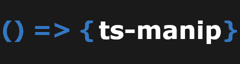

# ts-manip

<div style="text-align: center;">



</div>

<p style="text-align: center;">
	<b>Manipulate arrays and objects efficiently.</b>
	<br/>
	<br/>
	<a href="https://github.com/JasonMejane/ts-manip">
		
	</a>&nbsp;
	<a href="https://www.npmjs.com/ts-manip">
    	
	</a>&nbsp;
	<span>
		
	</span>&nbsp;
	<a href="https://github.com/JasonMejane/ts-manip/blob/master/LICENSE">
		
	</a>
	<span>
		
	</span>&nbsp;
	<a href="https://github.com/JasonMejane/ts-manip/issues">
		
	</a>&nbsp;
	<br/>
	<span>
		
	</span>&nbsp;
	<span>
		
	</span>&nbsp;
</p>

## Install

In terminal, run:
```sh
npm i ts-manip
```


### Import

```typescript
import * as manip from 'ts-manip';
```

### Available functions
- **additiveMergeDeep:** Performe a deep additive merge on values of an object, on a (key, value) basis
- **filter:** Filter elements of an array
- **filteredMap:** Map an array to another, thanks to a tranform function, filtering the elements to keep thanks to a predicate function
- **findFirst:** Find the first matching element in an array
- **findLast:** Find the last matching element in an array
- **forEach:** Iterates over elements of an array and invoke a function for each element
- **forEachAsync:** Iterates over elements of an array and invoke an asynchronous function for each element
- **map:** Map an array to another, thanks to a tranform function
- **numericDiff:** Return the differences of numeric values between 2 objects of the same type
- **reduce:** Reduce an array to a new single value, thanks to a tranform function.
- **splitIntoMultiple:** Split an array into an array of arrays of length <= to a given max length

### Examples

```typescript
const mapped = manip.map([1, 2, 3], (element) => { return element + 5; });
// mapped = [6, 7, 8];

const filtered = manip.filter(
	[{ id: 'aaa', type: 'a' }, { id: 'bbb', type: 'b' }, { id: 'ccc', type: 'a' }],
	(element) => { return element.type === 'a'; }
);
// filtered = [{ id: 'aaa', type: 'a' }, { id: 'ccc', type: 'a' }];

const difference = manip.numericDiff({ A: 10, B: -20 }, { A: 5, B: 30 });
// difference = { A: -5, B: 50 };

const result = manip.additiveMergeDeep(
	{ A: 5, B: 'part1', C: true, D: [1, 3], E: { val: 10 }, F: 25 },
	{ A: 10, B: '-part2', C: false, D: [5, 6], E: { val: 2, score: 1 } }
);
// result = { A: 15, B: 'part1-part2', C: false, D: [1, 3, 5, 6], E: { val: 12, score: 1 }, F: 25 };
```

## Contribute

Please feel free to suggest features or bug fix through Git issues. Pull Requests for that are also more than welcome.
